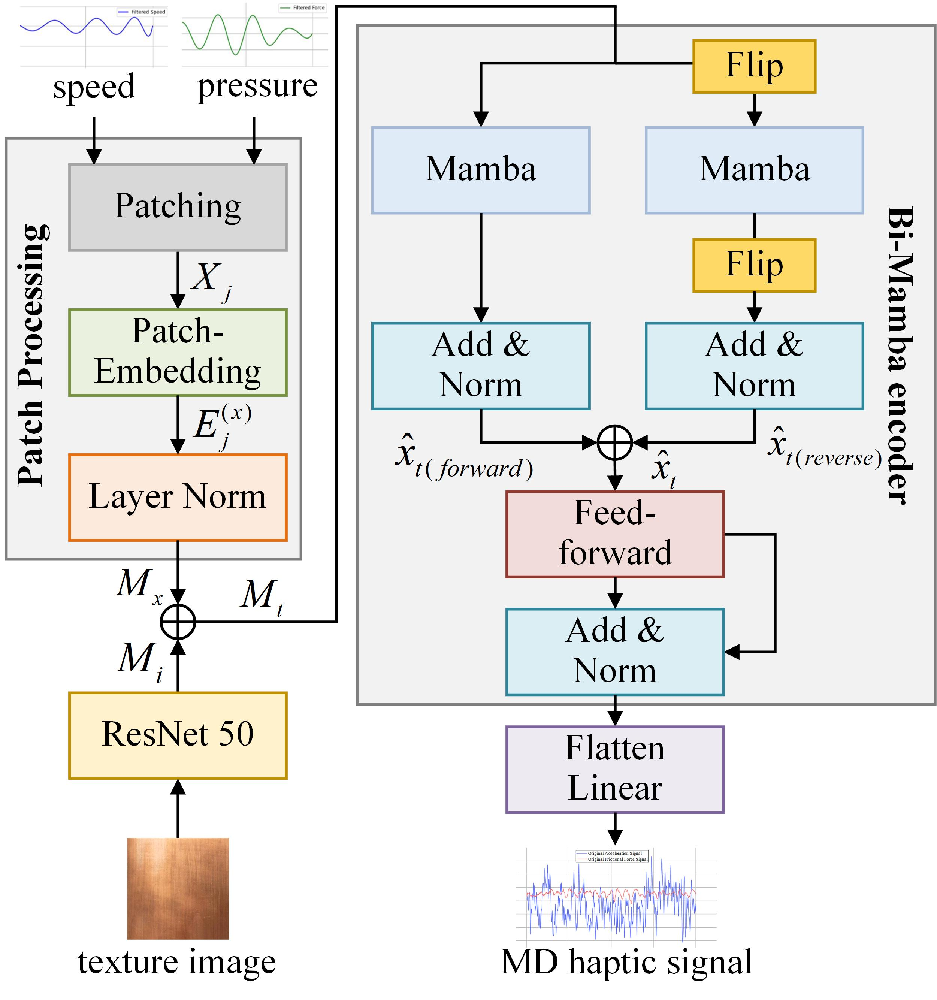
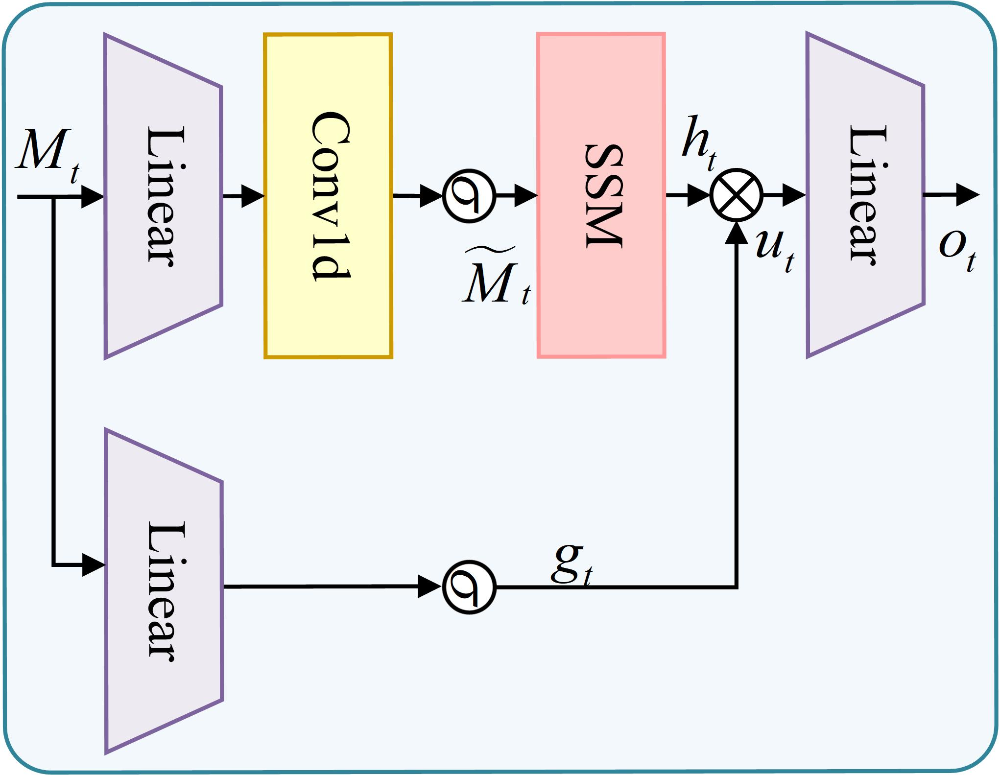

<h1 align="center">Multi-dimensional Texture Haptic Cross-modal Generation and Display Method based on Bi-Mamba Network</h1>

<p align="center">
Dapeng Chen, Yi Ding, Peng Gao, Haojun Ni, Hong Zeng, Jia Liu, and Aiguo Song 
</p>

<p align="center">
Nanjing University of Information Science and Technology  
</p>

<br/>

<h1 align="center">ABSTRACT</h1>

The haptic perception of texture has significant multi-dimensional (MD) characteristics, mainly composed of key attributes such as roughness, friction, and hardness. These dimensions not only reflect the microstructure of object surfaces, but also serve as the foundation for achieving real haptic feedback in virtual interactions. The integration of MD perception enhances the consistency and immersion of haptic rendering, especially in dynamic interactions that integrate user action information. However, existing modeling methods often focus on a single dimension, which is difficult to meet the demand for high immersion and adaptability. Therefore, we proposed an end-to-end MD texture haptic rendering model. This model takes the Mamba encoder as the core, integrates texture images and the real-time action information of users, and jointly predicts high-quality acceleration and friction signals. To train and validate the model, a set of equipment for collecting sliding speed and normal pressure was designed. Data interacting with 70 real textures were collected, and a training set was constructed in combination with the SENS3 dataset. In tests conducted across four distinct scenarios, our model exhibited robust signal reconstruction capabilities (RMSE is 0.032), outperforming the baseline model in overall performance. Furthermore, it demonstrated strong generalization abilities for common textures such as leather, fabric, and wood. Additionally, the delay of the haptic display system controlled between 32～38 ms, below the 40 ms haptic perception threshold. Finally, we conducted two user experiments. The results indicate that the rendering model that integrates roughness and friction feedback significantly improves the accuracy of users in distinguishing between real and virtual textures. The proposed method achieved the highest perceptual average similarity score to date (6.99), effectively enhancing the user's realistic experience with virtual textures.

<h1 align="center">MULTI-DIMENSIONAL TEXTURE HAPTIC RENDERING MODEL</h1>

The objective of this study is to establish a mapping relationship between multi-modal information (texture images *i*, sliding speed *v*, and normal pressure *p*) and multi-dimensional haptic outputs (acceleration signal *a* and friction signal *f*), which can be represented as *g(i, v, p) → a, f*, where *g(·)* represents the prediction model. Taking inspiration from existing work, this paper designs a multi-dimensional texture haptic rendering model based on real-time action information, and its overall structure is shown below.

<p align="center">
  
</p>

<p align="center">
  
</p>

<h3 align="center">DETAILS OF IMPLEMENT</h3>

### Environmental equipment
Configure necessary environment packages based on `requirements.txt`.

### Parameter path setting
Enter `configs/configs.py` to adjust the path of the data file.
```bash
configs/configs.py
```

### Dataset
We used the SENS3 dataset and the 70 real texture sample data we collected as the training and testing sets for the model. The SENS3 dataset covers 50 different texture images from 10 categories, and includes data on three-axis forces, torques, and velocities recorded by experimenters sliding on each texture surface for 5 seconds under controlled force velocity matrix conditions. We take the force component in the *z* axis direction as the compressive force, and calculate the frictional force by synthesizing the force components in the *x* and *y* axes. Its magnitude can be expressed as: *f = √(Fx² + Fy²)*.
For more details, see https://link.springer.com/chapter/10.1007/978-3-031-70058-3_21


The partially collected multi-dimensional texture data can be viewed in the folder "The dataset we collected".

### Data Preparation
Start by running `utils/data_deal.py` to retrieve and organize the required original dataset.
```bash
utils/data_deal.py
```

Then run `utils/dataprocess.py`, align the excel data by file name and merge it into a csv file. Crop the data before and after and save it as a standardized result.
```bash
utils/dataprocess.py
```
### Model Training
Adjust "args. is_training==1" in `configs/configs.py`, and use `main.py` to train the model. Adjust parameters such as epoch and batch_2 according to the training environment.
```bash
main.py
```
### Testing
Adjust "args. is_training==2" in `configs/configs.py`, and use `main.py` to validate results on the test set.

### Real Texture Modeling
Before using the model for real texture modeling, run `utils/dataset.py` to adjust the format of images corresponding to real textures, ensuring consistency with our dataset's image format.
```bash
utils/dataset.py
```

